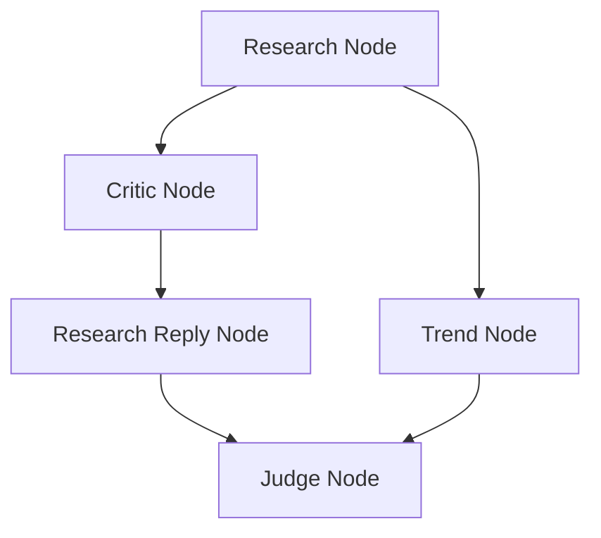

# ResearchMind AI - LangGraph Concurrent State Management Architecture

This document explains the architecture of the concurrent multi-agent state manager implemented in ResearchMind AI. It describes how LangGraph handles shared states across parallel agent execution paths and how conflicts are resolved at scale.

## 1. Why Reducers are Required in LangGraph

By default, LangGraph nodes overwrite state fields when they return updates. In a sequential workflow, this is fine because each node performs its action and passes its final dictionary to the next.

However, in parallel execution patterns (e.g., when the `Critic Agent` and `Trend Analyst Agent` execute simultaneously after the `Research Agent`), a race condition occurs:
- If a state field like `debate` is defined as a standard `List`, the node that completes first will write its contribution to the state.
- The node that completes second will overwrite the entire `debate` key with its own list, discarding the first node's changes.
- In some scenarios, LangGraph throws an `InvalidConcurrentGraphUpdate` exception because two concurrent nodes try to write conflicting updates to the same state key.

Reducers are specialized merge functions that dictate **how** state updates from different nodes should be combined rather than overwritten.

## 2. How `Annotated` Reducers Work

LangGraph uses Python's typing `Annotated` metadata to register reducer functions to specific keys in the `StateGraph`'s schema.

For example:
```python
from typing import Annotated, List
import operator

class ResearchState(TypedDict):
    debate: Annotated[List[DebateMessage], operator.add]
```

When a node returns `{"debate": [new_message]}`, LangGraph checks the `debate` key, sees that it is annotated with `operator.add`, and instead of performing `state["debate"] = [new_message]`, it executes:
```python
state["debate"] = operator.add(state["debate"], [new_message])
```
This appends the list of new messages to the existing list, preventing any overwrites.

## 3. Why `operator.add` was Selected for Debate Messages

`operator.add` maps to Python's addition operation (`+`). For Python lists, addition performs list concatenation:
`[a, b] + [c] -> [a, b, c]`

This selection offers several key benefits for debate logging:
1. **Incremental Updates**: Nodes only need to return their new contribution (e.g., `[my_new_message]`). They do not need to read the previous messages, append to them, and return the whole list. This keeps node functions pure and limits memory operations.
2. **Order-Preserving Concatenation**: When nodes run in parallel, LangGraph invokes the reducer as soon as each node completes, appending their lists in the chronological order of their completion.
3. **Purity**: The reducer function runs inside LangGraph's engine, ensuring node functions themselves do not modify state directly.

## 4. How Concurrent State Updates are Merged

During execution, when the graph reaches a parallel fork (e.g., after the `research` node finishes):



1. **Forking**: The `critic` and `trend` nodes are scheduled to run concurrently.
2. **First completion**: Suppose `trend` completes first and returns `{"debate": [trend_message], "trend_output": {...}}`. LangGraph immediately updates the shared state, appending `trend_message` using `operator.add` and writing `trend_output`.
3. **Second completion**: A few moments later, `critic` completes and returns `{"debate": [critic_message], "critic_output": {...}}`. LangGraph receives this update and runs the reducer again, appending `critic_message` to the state's `debate` list.
4. **Synchronization**: At the join node (`judge`), LangGraph waits for all parallel incoming edges (`research_reply` and `trend`) to complete. The state at `judge` now contains a fully merged `debate` list containing both messages in order of completion, along with `trend_output` and `critic_output`.

## 5. Support for Future Parallel Expansion

The implemented state-management pattern is fully scalable for future expansion without requiring changes to the core state definitions:
- **Zero-Config Agent Addition**: If you introduce a new concurrent agent (e.g., a `Regulatory Compliance Agent` or a `Competitive Analyst Agent`), you can wire them into the graph in parallel using `workflow.add_edge("research", "compliance")` and join them at `judge`.
- **Conflict-Free Writes**: As long as the new nodes return their incremental contributions as lists under the `debate` key, the `operator.add` reducer will automatically concatenate them without duplicate conflicts or overwrite issues.
- **Independent Storing**: Other keys, such as specific agent outputs (e.g. `critic_output`, `trend_output`), are kept in isolated keys. If multiple agents write to distinct keys, no conflicts occur. If they write to the same key, those keys must be annotated with appropriate reducers (e.g. a merge dict reducer).
